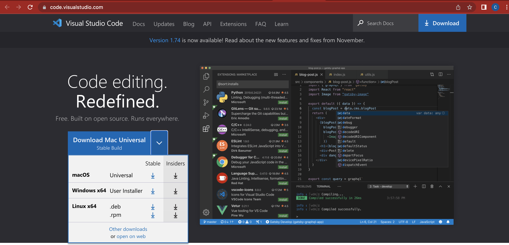
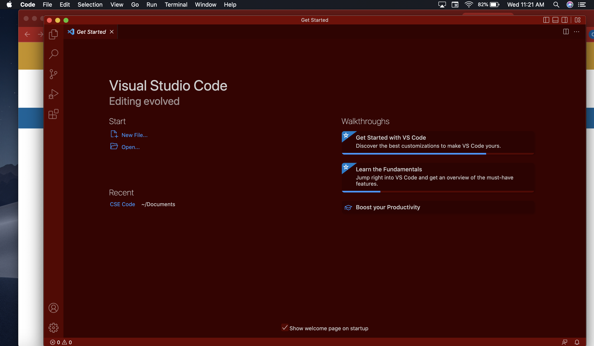

# ***Week 1 Lab Report***
This is a tutorial for how to log into a course-specific account on ieng6 for CSE 15L and to run commands on a remote server. This guide will go through how to install VScode, how to connect to a remote server, and how to execute some commands in the terminal.

## Accessing your CSE 15L account
Go to this [link](https://sdacs.ucsd.edu/~icc/index.php) and enter your username and student ID to access your course-specific account.

**Steps to reset password:**
1. Click on the button where Additonal Accounts is located. That is your account name for CSE 15L.
2. After clicking the button, you then must click on the change your password link. Then type in your username and password again.
3. You are now in this page:

Enter your current password and your new password for this CSE 15L account. **You must have** `Change MyTritonLink password?` **as** `No` **and** `Change course-specific account passwords?` **as** `Yes`.
4. **Important**: Instead of clicking the `Check Password` button, you must instead click `return` after confirming your new password.
5. After that, the new page should have it say that your password was accepted and you must wait a few minutes for you to access your account.
6. To check if you can access you can check with the terminal which will be covered in the later part of this guide.

## Installing VSCode
Go to this [VScode website link](https://code.visualstudio.com/) to install VScode code editor based on your own operating system such as, macOs and Windows.

**This is what the download page would look like:**

**When done downloading, open the VScode application and this is what the home page would look like:**

**You have now install VScode in your personal computer and can proceed to the next steps.**

## Remotely Connecting
Now that you've installed VScode, you can open it up and use the `Ctrl`+`Shift`+`P` shortcut to access the editor commands. Then, you can enter terminal and choose either `Terminal: Create New Terminal` to stay in the VScode app or `Open New External Terminal`.

**Terminal: Create New Terminal:**

**Open New External Terminal:**

In your terminal you must type in `ssh accountname@ieng6.ucsd.edu` with you replacing accountname with your course-specific account name. When its your first time logging in, you must type in `yes` in response to `Are you sure you want to continue connecting (yes/no/[fingerprint])?` in the terminal. After that, type in your password for your course-specific account on ieng6 for CSE 15L.

After you're login, this is an example of what it may look like:

**You are now ready to write some commands into the terminal.**

## Trying Some Commands
With you having a terminal open and signed into your account, you can now run commands in the terminal. There are many commands you can execute such as:
* `cd`
* `ls`
* `pwd`
* `mkdir`
* `cp`

This example contains:
* `mkdir`: makes a new directory or multiple directories
* `ls -lat`: orders the directories or files in by creation time
* `ls`: lists computer files and directories

To exit the remote server, you can either type in the command `exit` or `Ctrl`+`D`.

**You have now finished this guide for logging into your CSE 15L account using a terminal to execute commands on a remote server. Hope that this guide has helped you!**
---

