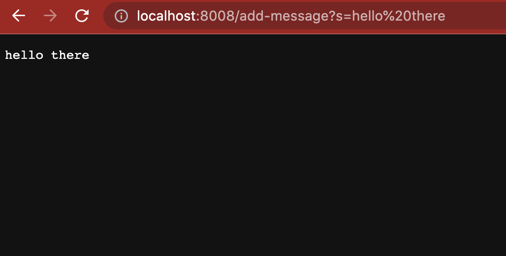
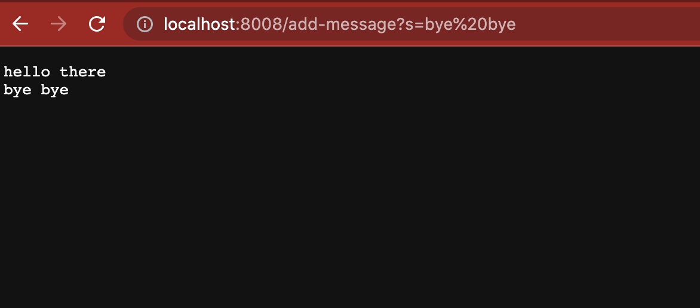

# **Week 2 Lab Report**
## **_Part 1_**
Code for StringServer.java
```
import java.io.IOException;
import java.net.URI;

class Handler implements URLHandler {
    // The one bit of state on the server: a number that will be manipulated by
    // various requests.
    String wordsString = "";

    public String handleRequest(URI url) {
        if (url.getPath().equals("/")) {
            return wordsString;
        } else {
            System.out.println("Path: " + url.getPath());
            if (url.getPath().contains("/add-message")) {
                String[] parameters = url.getQuery().split("=");
                if (parameters[0].equals("s")) {
                    wordsString += parameters[1] + '\n';
                    return wordsString;
                }
            }
            return "404 Not Found!";
        }
    }
}

class StringServer {
    public static void main(String[] args) throws IOException {
        if (args.length == 0) {
            System.out.println("Missing port number! Try any number between 1024 to 49151");
            return;
        }

        int port = Integer.parseInt(args[0]);
        Server.start(port, new Handler());
    }
}
```
| Path      | Description |
| ----------- | ----------- |
| `add-message?s=hello there`
| * b
|
| Paragraph   | Text        |


* Methods called: `public String handleRequest(URI url)` and `class StringServer`
* 

Path : `add-message?s=bye bye`

* Methods called: `public String handleRequest(URI url)` and `class StringServer`

## **_Part 2_**
Chosen faulty method from the ArrayExamples.java file :
```
  static int[] reversed(int[] arr) {
    int[] newArray = new int[arr.length];
    for (int i = 0; i < arr.length; i += 1) {
      arr[i] = newArray[arr.length - i - 1];
    }
    return arr;
  }
```
A failure-inducing input for the buggy program:
```
@Test
  public void testReversedMultiple() {
    int[] input1 = { 3, 2, 1 };
    assertArrayEquals(new int[] { 1, 2, 3 }, ArrayExamples.reversed(input1));
  }
  ```
An input that doesn’t induce a failure :
```
@Test
  public void testReversed() {
    int[] input1 = {};
    assertArrayEquals(new int[] {}, ArrayExamples.reversed(input1));
  }
 ```
 Symptom of faulty program:
 
 | Before      | After |
| ----------- | ----------- |
| <pre>static int[] reversed(int[] arr) {<br>  int[] newArray = new int[arr.length];<br>  for(int i = 0; i < arr.length; i += 1) {<br><p style="red"><ins>arr[i] = newArray[arr.length - i - 1];</ins></p><br> }<br> return arr;<br>}| <pre>static int[] reversed(int[] arr) {<br> int[] newArray = new int[arr.length];<br> for (int i = 0; i < arr.length; i += 1) {<br><p style="green"><ins>newArray[i] = arr[arr.length - i - 1];</ins></p><br> }<br> return newArray;<br>}      |
| The line highlighted is the   | Text        |

## **_Part 3_**
