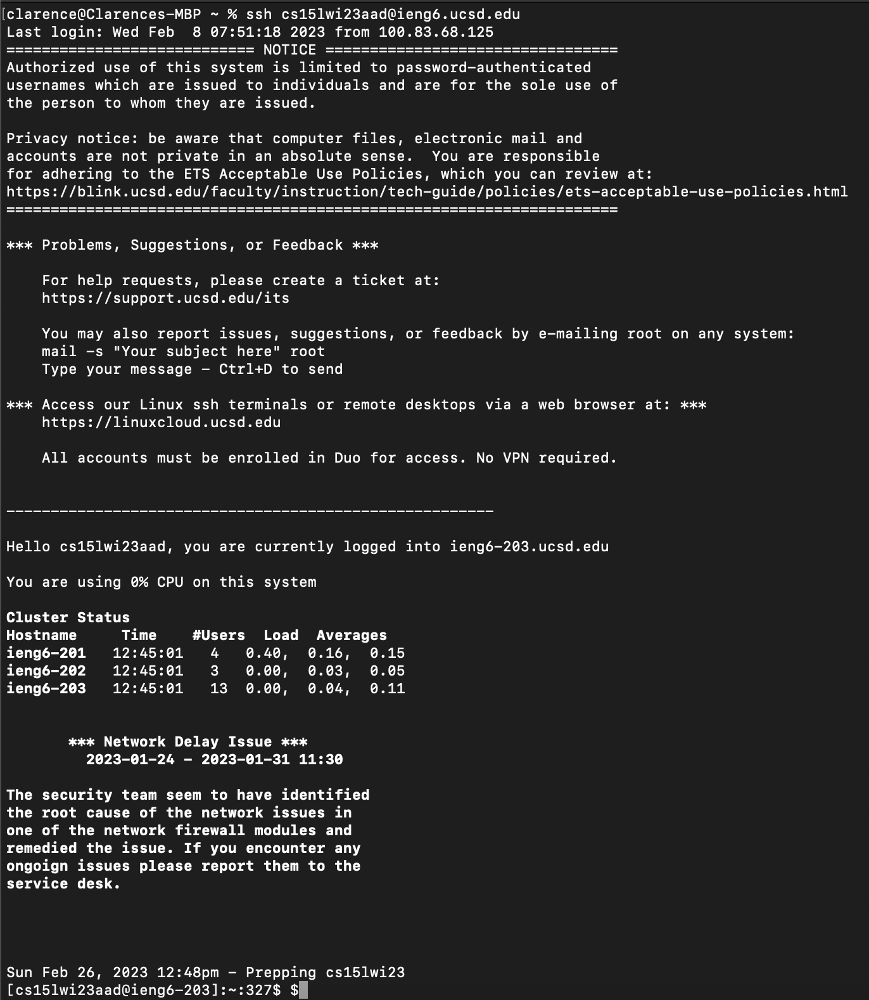
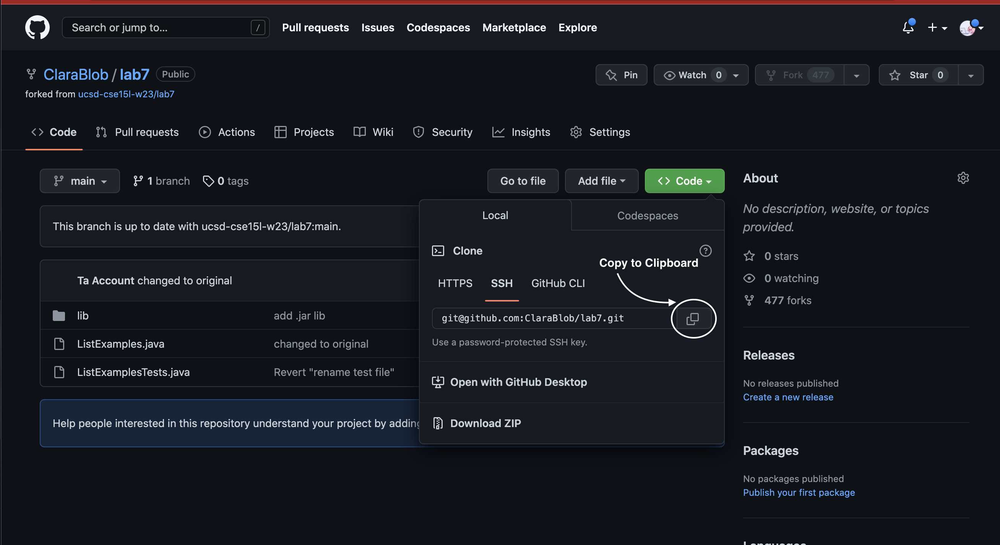
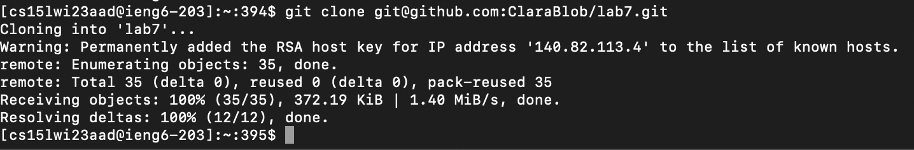
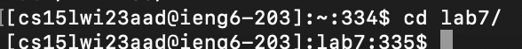
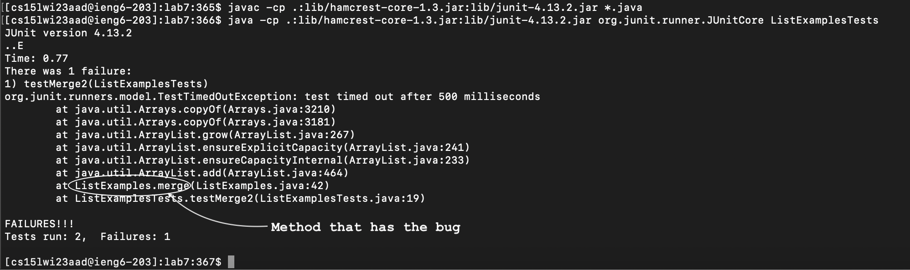
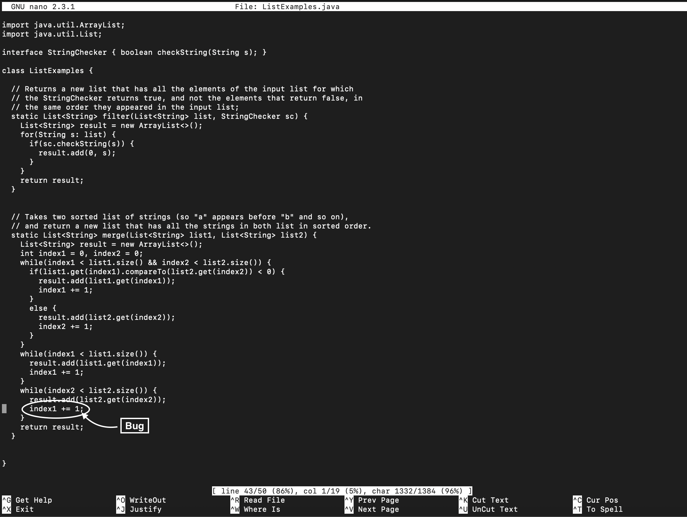
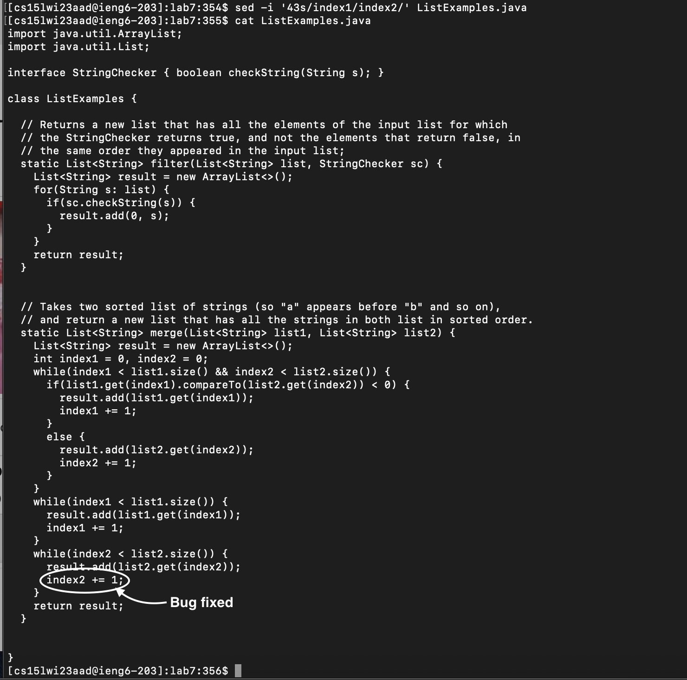
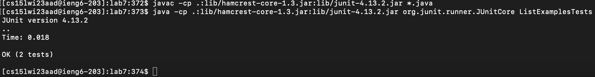
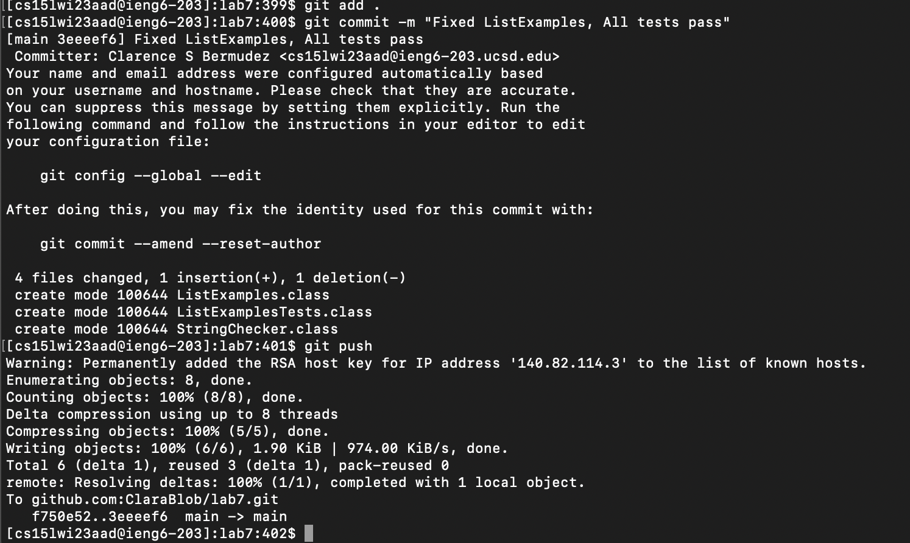
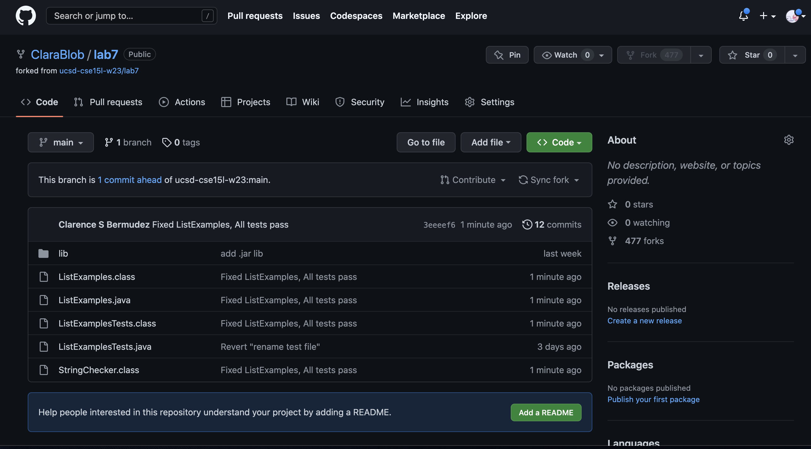

# **Week 4 Lab Report**
## Setup
### **1. Setup Delete any existing forks of the repository you have on your account**
### **2. Setup Fork the repository**
### **3. The real deal Start the timer!**

## **Challenge Task**
### **4. Log into ieng6**
To login into the ieng6 account, I typed into the terminal `ssh cs15lwi23aad@ieng6.ucsd.edu` and press the `<return>` key.

### **5. Clone your fork of the repository from your Github account**

**Copying the lab report repository URL:**
Go to my lab report repository. Click on the `<> Code` button, then click on `SSH`, and then click on the `Copy to Clipboard` `❐` button to copy the github repository URL.

**Cloning the lab report repository:**
 After copying the URL, type in to the terminal, `git clone` then press `<Ctrl> (^)` + `V` to paste the repository URL. After pasting the URL, press `<return>` to clone the repository. 

### **6. Run the tests, demonstrating that they fail**
Firstly, type in `cd la` then press `<tab>` to autofill to `cd lab7/` and then press `return>` to go into the `lab7` directory. 

To run the tests, you first must compile and then the test file of the lab report. To compile, press `<Crtl>` + `r` to access my bash history, and type in `javac` which will autofill to `javac -cp .:lib/hamcrest-core-1.3.jar:lib/junit-4.13.2.jar *.java` and then press `return` to compile the java files. After that, again press `<Ctrl>` + `r` and type in `java ` will it having a space at the end to autofill to `java -cp .:lib/hamcrest-core-1.3.jar:lib/junit-4.13.2.jar org.junit.runner.JUnitCore TestListExamples` and then press `return` to run the tests.

Picture that shows that `ListExamplesTests.java` tests fail:

### **7. Edit the code file to fix the failing test**
Without first knowing where the bug is, I first type in `nano -c ListExample.java` to view the `static List<String> merge (List<String> list1, List<String> list2)` method due it being the one test that is failing. Press `<Ctrl>` + `X` to exit `nano`.

**`nano` Method:**
Doing `sed` is faster if you know where the bug is in the java file, but you can edit it in `nano` mode by holding `<down>` key until it reaches the `index1 += 1;` on line 43. Then, press `<right>` key 12 times, press `<delete>`, and type `2` to have `index2` instead of `index1`. To save, press `<Crtl>` + `O`, press `<return>`, and lastly press `<Ctrl>` + `X`.

**`sed` Method:**
Being that I already know that the bug occurs on line 43, I typed in `sed -i '43s/index1/index2/' Li`, then press `<tab>` to autofill to `ListExamples` and type `.java` to have the command `sed -i '43s/index1/index2/' ListExamples.java` and lastly press `<return>`. 

Type in `cat ListExamples.java` to see change.

### **8. Run the tests, demonstrating that they now succeed**
To see that the test now passes, press `<Ctrl>` + `R` and type in `javac` and then press `<tab>` to autofill to `javac -cp .:lib/hamcrest-core-1.3.jar:lib/junit-4.13.2.jar *.java` in order to compile the new changes to  `ListExamples.java`. Then, press `<Ctrl>` + `R` and type in `java ` and then press `<tab` to autofill to `java -cp .:lib/hamcrest-core-1.3.jar:lib/junit-4.13.2.jar org.junit.runner.JUnitCore ListExamplesTests`. 

**Tests are now successful:**

### **9. Commit and push the resulting change to your Github account (you can pick any commit message!)**
To commit the changes to my Github account, firstly, I type in `git add .` to have this `lab7` directory to be the one being commited. Then, I type in `commit -m "Fixed ListExamples, All tests pass"` to commit the changes and have that messages for the commit. Lastly, type in `git push` to push the commit into my Github account.

**Github Lab Repository Page:**

