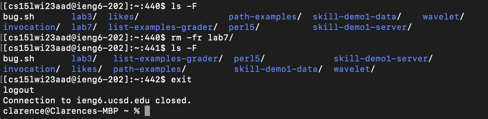
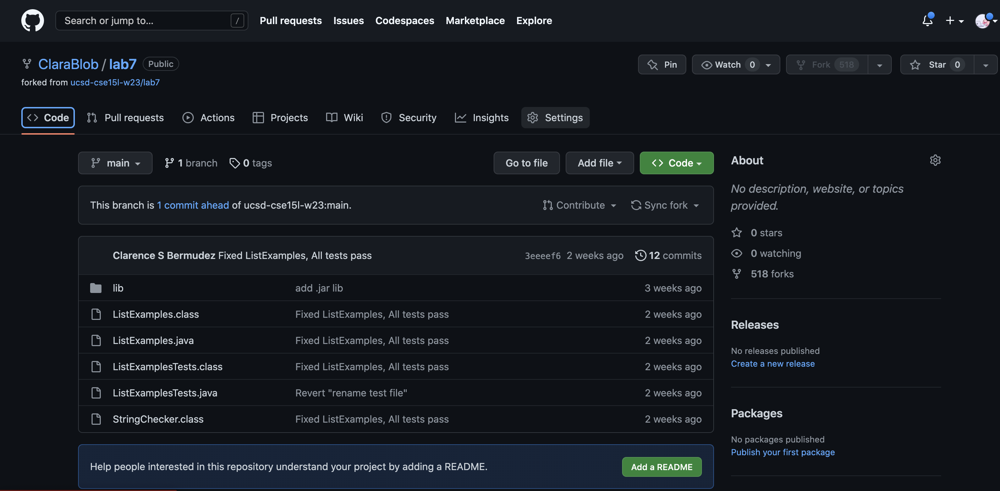
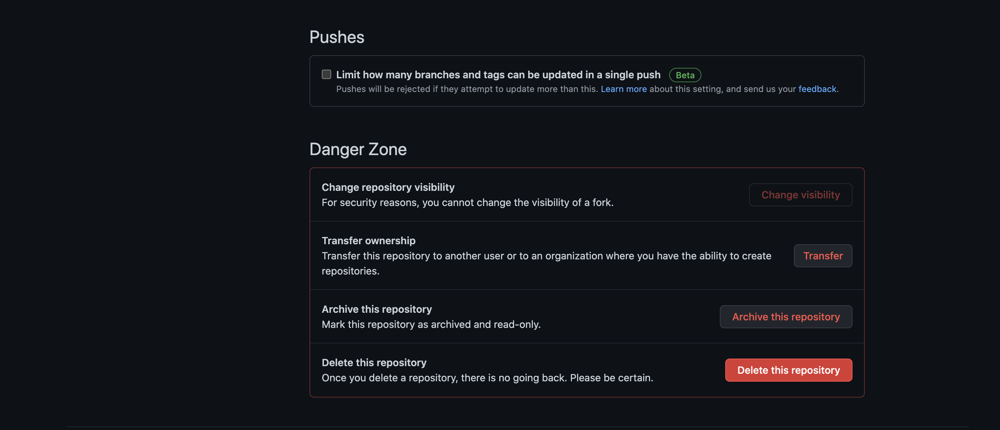
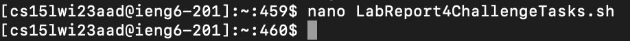
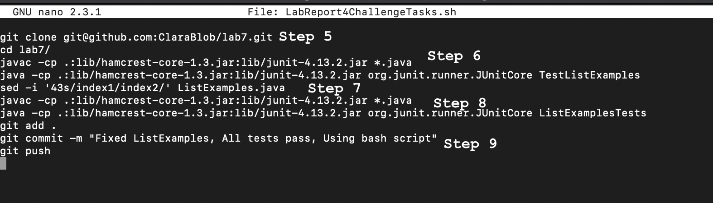
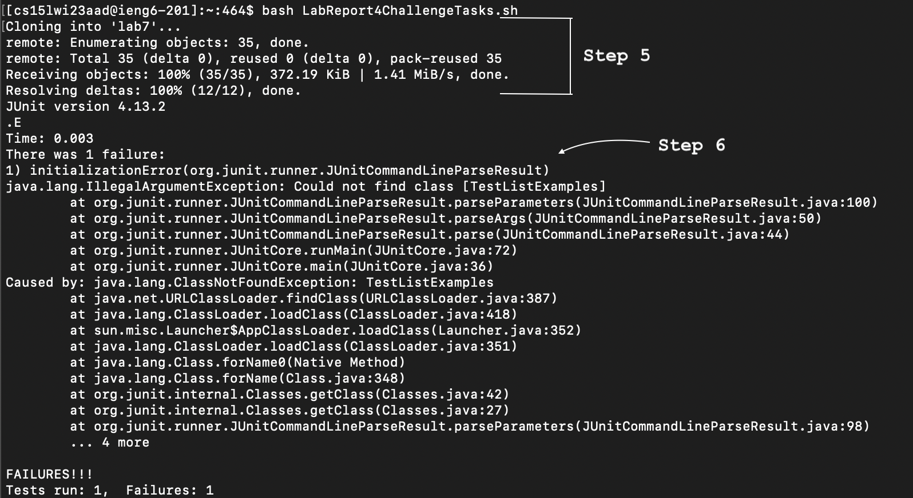
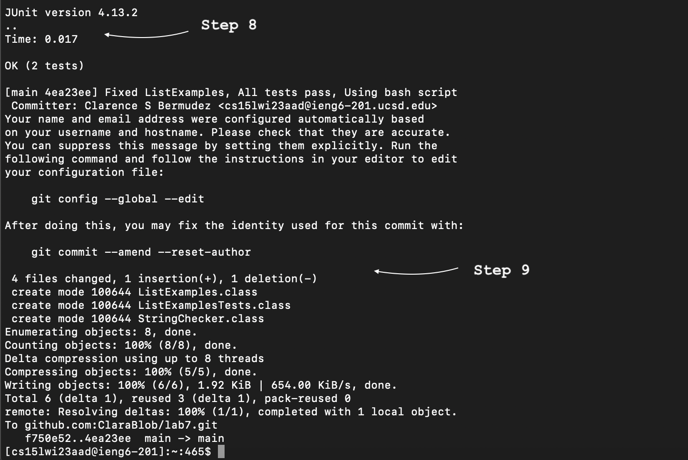
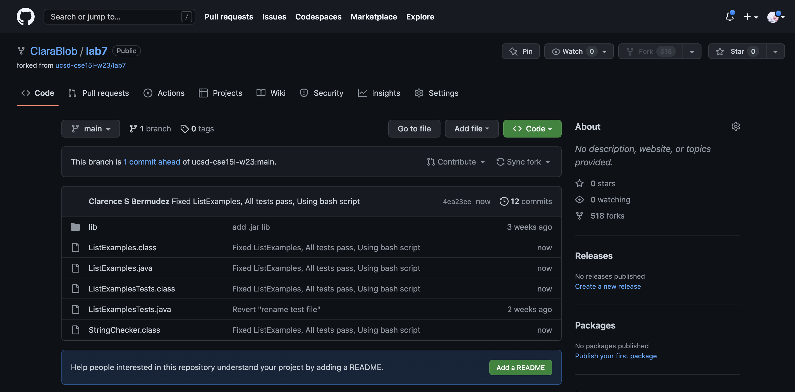

# **Week 5 Lab Report**
## My favorite Lab report was Lab Report 4. For this lab report, I used a bash script to quickly do the lab report in the matter of seconds instead of a minute or two. Also, utilized many other commands, such as `sed`, `nano` and reverse search command which was used in other lab reports. Through completing all these lab reports and labs, I have learned how to competently utilize the terminal commands and now be able to create bash scripts in which I can potentially use in my future projects.

## **Setup**

Firstly, delete the `lab7/` directory in my ieng6 account by typing in `<Ctrk>` + `r` and type in `ssh` and press `<tab>` to have `ssh cs15lwi23aad@ieng6.ucsd.edu` then press `<return>`. Then type the command `rm -rf lab7/` to delete the `lab7/` directory along with its files. (`-r`  indicates recursive removal and `-f` indicates removal without confirmation). 

Then, delete my existing fork of the `lab7` directory by clicking on the settings button and then scroll down to delete the respository. There is a confirmation page for you to delete the respository.

## **Bash Script Creation:**

My first step is to sign into my ieng6 account by typing in `<Ctrk>` + `r` and type in `ssh` and press `<tab>` to have `ssh cs15lwi23aad@ieng6.ucsd.edu` then press `<return>`(**THIS IS STEP 4**). Then, type in `nano LabReport4ChallengeTasks.sh` to create my bash script and have `nano` open in one line. 

In `nano`, I will type in all the commands that I used for my Lab Report 4 for the challenge tasks, starting from Step 5 and ending at Step 9 pressing `<return>` after every command.

**After that, I saved the bash script by pressing `<Crtl>` + `O`, press `<return>`, and lastly press `<Ctrl>` + `X`. Then, I type in `bash LabReport4ChallengeTasks.sh`**

## **Steps 5-6:**
The first line in the bash script describes cloning the fork of the `lab7` repository by `git clone` along with the `SSH` of the repository that was copied from Github by clicking on the `Copy to Clipboard` button.

Step 6 starts off with the second command in the bash script going to the `lab7` directory. Then, the third line `javac -cp .:lib/hamcrest-core-1.3.jar:lib/junit-4.13.2.jar *.java` compiles all the `.java` files and the fourth line `java -cp .:lib/hamcrest-core-1.3.jar:lib/junit-4.13.2.jar org.junit.runner.JUnitCore TestListExamples` runs the tests which shows that there is 1 failed test.

## **Steps 7-9:**
For Step 7, I already know where the bug occurs so for the bash script, the fifth command `sed -i '43s/index1/index2/' ListExamples.java` it fixed the bug at line 43 by changing the `index1 += 1` to `index2 += 1`. For Step 8, the sixth command `javac -cp .:lib/hamcrest-core-1.3.jar:lib/junit-4.13.2.jar *.java` to compile the new changes to `ListExamples.java` and the seventh command `java -cp .:lib/hamcrest-core-1.3.jar:lib/junit-4.13.2.jar org.junit.runner.JUnitCore ListExamplesTests` runs the tests and shows that it all passes now.

For Step 9, the eighth command, `git add .` has this `lab7` directory to be the one being committed changes, the ninth command `commit -m "Fixed ListExamples, All tests pass, Using Bash Script"`, commits the changes along with a message and lastly, the tenth command `git push` pushes the commit to my Github account.

