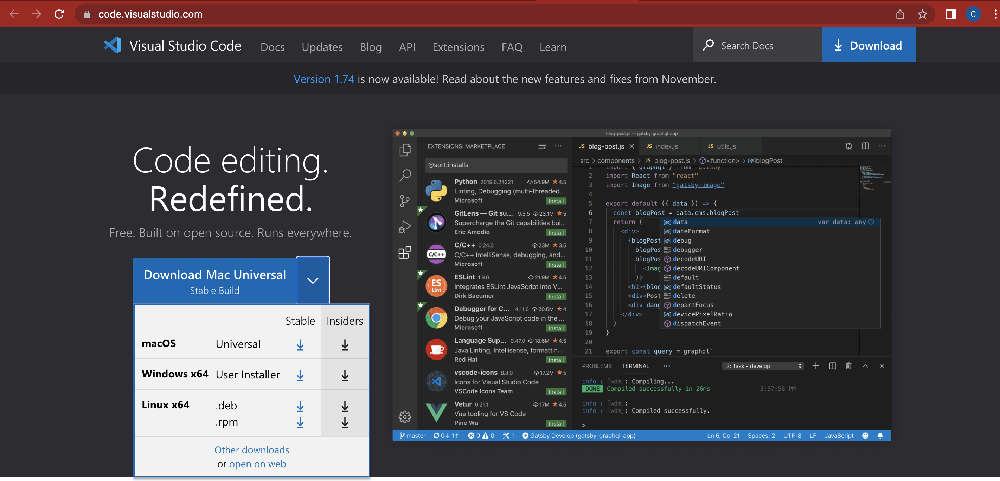
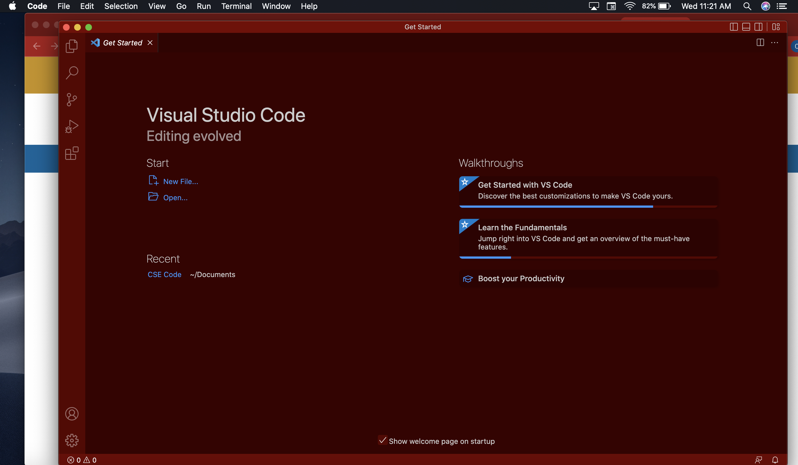

# ***Week 1 Lab Report***
This is a tutorial for how to log into a course-specific account on ieng6 for CSE 15L.

## Installing VSCode
Go to this [VScode website link](https://code.visualstudio.com/) to install VScode code editor based on your own operating system such as, macOs and Windows.

This is what the download page would look like:

When done downloading, open the VScode application and this is what the home page would look like:

You have now install VScode in your personal computer and can proceed to the next steps.

## Remotely Connecting
Now that you've installed VScode, 
## Trying Some Commands

